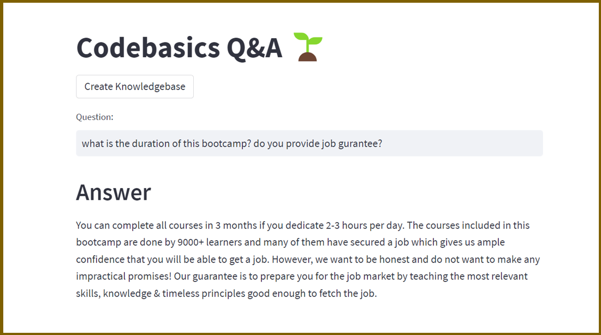

# LLM-QA-Bot
This is an End-to-End LLM question-and-answer system using the langchain framework.




## Project Highlights
- Use a real CSV file of FAQs that Codebasics company is using right now.
- Their human staff will use this file to assist their course learners.
- We will build an LLM based question and answer system that can reduce the workload of their human staff.
- Students should be able to use this system to ask questions directly and get answers within seconds


## Technical Architecture


- Langchain + ChatGoogleGenerativeAI: LLM based Q&A
- Streamlit: UI
- Huggingface instructor embeddings: Text embeddings
- FAISS: Vector databse


## Concepts:
### 1. LangChain
There is a big boom in the industry where every business wants to build their own LLM

**Why companies cannot directly use ChatGPT or use OpenAI API?**
- ChatGPT has no access to internal organization data
- Calling OpenAI API has higher cost (number of queries -> huge cost)
- ChatGPT has no access to internet / real time knowledge

**This is how Langchain comes into place. What is LangChain then?**
- LangChain is a framework that allows you to build applications based on LLM with external data sources, memory, and other utilities.

**What are the main properties of LangChain framework?**
- **Components**:  
  Components are modular building blocks that are ready and easy to use to build powerful applications. Including:  
  - LLM Wrappers: unified interface to interact with different LLMs)
  - Prompt Template: standardized input fed into the LLMs)
  - Indexes: structure large datasets or documents for quick search).

- **Chains**:  
  Chains refer to sequences of actions that the application will perform. Chains allow you to combine multiple components or tasks into a single workflow.

- **Agents**:  
  Agents use LLMs to make decisions about what actions to take. They interact with external tools (e.g., search engines, APIs, or databases) to fetch real-time or extended information.

- **Memory**:  
  Langchain allows applications to have memory, which means that the application can remember previous interactions and use that context for future conversations.

### 2. Vector Database
**How does Google search figure out the different meaning of "Apple" between "calories in Apple" and "employees in Apple"?**
- **Semantic search**:  
  Instead of keyword matching, it understands the intent of user query and use the context to perform the search
  
- **Embedding** (internal mechanism of semantic search):  
  Embedding is a numerical representation of text, which is a vector that contains values for several features.
  
- **Transformer architecture**:  
  One of the most popular word embedding techniques that chatGPT is using.

**How to store the embedding vectors?**
- **Traditional relational database**  
  We first store embeddings into database. Then for a user query:  
  generate an embedding -> linear search the database to calculate `cosine similarity` -> if value closes to 1 then put vector into result dataset
  
  Problem: too many computations and long delay, cannot handle millions of records

- **Vector database**  
  It uses `index` to help you search things faster. How does the database index works?
  It use a hashing function to create buckets of similar looking embeddings so that for the user query, we only need to linear search a small size of data in one bucket.  
  The Technique is called `LSH (Locality Sensitive Hashing)`

  Benefits: fast search & optimized storage
  

## Challenges / Problems

### 1. LLM hallucinations 
> Observations:
> 1. The model sometimes generate answer based on its own knowledge instead of CSV file
> 2. The model generate random answer based on questions that are not found in the CSV file
>
> What we want:  
> - look at the CSV file and if there is an answer, pull the answer from there.
> - If there isn't an answer, simply output I don't know

“Hallucinations” in LLM means the generation of false or misleading information.
The model produces outputs that are coherent and grammatically correct but factually incorrect or nonsensical.

**-> How to solve:**  
Use the prompt template to constrain LLM's behavior
```python
from langchain.prompts import PromptTemplate

prompt_template = """Given the following context and a question, generate an answer based on the following pieces of context only.
In the answer try to provide as much text as possible from "response" section in the source document context.
If you can't find the answer in the context, please kindly state "I don't know."

CONTEXT: {context}

QUESTION: {question}"""
```

### 2. Protect credentials
> What we want:  
> - Do not want to spread credentials into public repository like github.

**-> How to solve:**  
Industry practice: Use dotenv package and create one .env file to centralize configuration management.
```python
from dotenv import load_dotenv
load_dotenv() # dotenv will go to .env file to read each key-value pair, and set them as operating system env variable

os.environ["GOOGLE_API_KEY"] # use os.envrion to invoke variable in .env file
```

### 3. VectorDB persistant storage
> What we want:  
> - Do not want to create the db each time we have a user query because creating VectorDB takes around 1min time.
> - Want to store VectorDB in disk instead of in memory.

**-> How to solve:**  
Create the VectorDB in advance and save it locally.
So that you only need to create one time and for further QA query, you just simply use it.
Once the CSV got updated, that is the time we will create the database again.
```python
vectordb_file_path="faiss_index"
def create_vector_db():
    # Load data from FAQ sheet
    loader = CSVLoader(file_path='codebasics_faqs.csv', encoding="ISO-8859-1", source_column='prompt')
    docs = loader.load()

    # Create a FAISS instance for vector database from 'data'
    vectordb = FAISS.from_documents(documents=docs, embedding=instructor_embeddings)

    # Save vector database locally
    vectordb.save_local("faiss_index")
```


